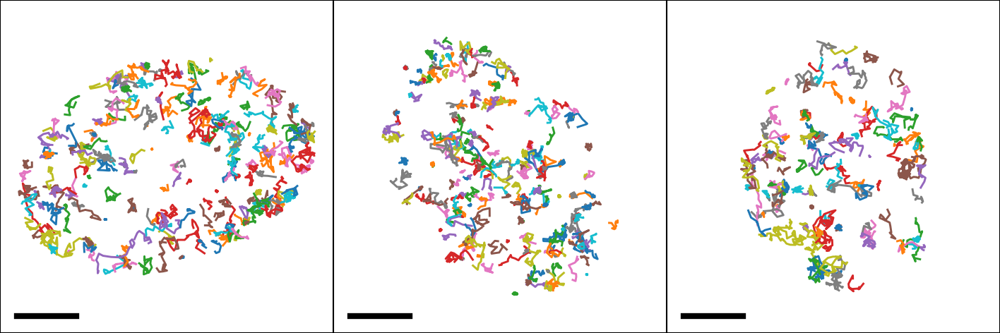
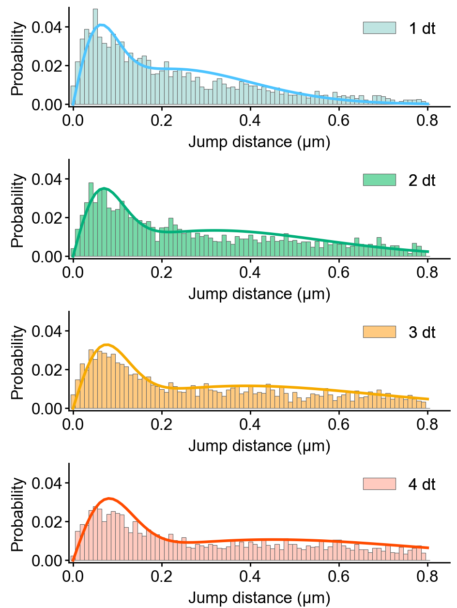
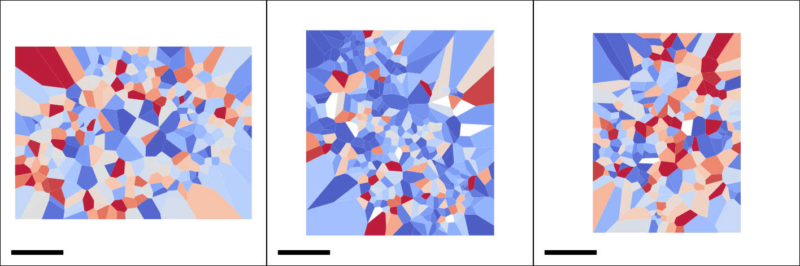
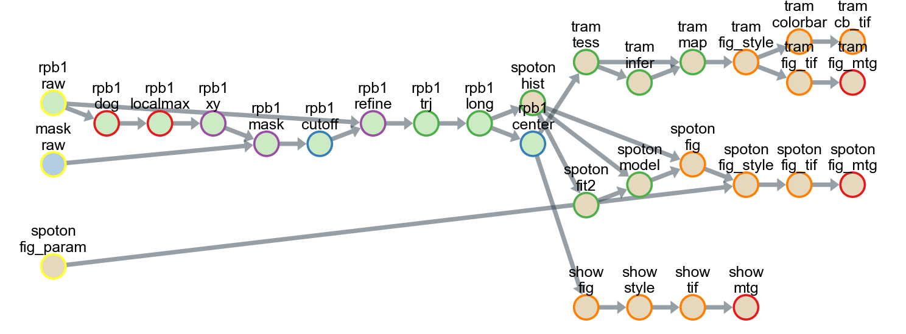

Advanced usage
===================

This tutorial demonstrates a workflow of state-of-the-art analyses using
single-molecule fluorescence movies in living cells.

1. Background
------------------
This example uses live-cell single-molecule movies of RNA polymerase II—that
is, Pol II, a transcriptional protein complex—from cultured cells.
Human U2OS cells expressing Halo-RPB1—the largest subunit of Pol II labeled
with a self-labeling HaloTag—were stained with 3 nM Janelia Fluor fluorescence
substrate, and excited using HILO illumination. 300 frames were captured
at 33.33 ms per frame using an EMCCD camera.

This tutorial uses the wrapping classes of Python packages, including trackpy,
fastspt, and tramway. Please consider citing the following references if the
classes are helpful for your research.

[1] Allan DB, Caswell T, Keim NC, van der Wel CM, Verweij RW. soft-matter/trackpy: Trackpy v0.5.0 2021.

[2] Hansen AS, Woringer M, Grimm JB, Lavis LD, Tjian R, Darzacq X. Robust model-based analysis of single-particle tracking experiments with Spot-On. Elife 2018;7.

[3] Laurent F, Verdier H, Duval M, Serov A, Vestergaard CL, Masson J-B. TRamWAy: mapping physical properties of individual biomolecule random motion in large-scale single-particle tracking experiments. Bioinformatics 2022;38:3149–50.

2. Installation
--------------------------
If you have a GitHub account, you can run the example in `Gitpod <https://www.gitpod.io/>`_.
You can also run the example on your local machine.

In the cloud
^^^^^^^^^^^^^^^
If you have a Google account, you can run the example in 
`Google Colaboratory <https://colab.research.google.com/>`_.
Click the following badge to launch the Jupyter notebook.

.. image:: https://colab.research.google.com/assets/colab-badge.svg
   :target: https://colab.research.google.com/github/yumaitou/slitflow/blob/main/scripts/notebook/getting_started_advanced.ipynb

If you have a GitHub account, you can run the example in Gitpod.
See :ref:`Installation for basic usage <getting_started_basic:Basic usage>` for details. Then, open the file ``scripts/getting_started_advanced.py``
and click the ``Run Python File`` button.

On your local machine
^^^^^^^^^^^^^^^^^^^^^^^^^^^
Additional Python packages are required for this tutorial. Please install them
using one of the provided pip commands.

.. code-block:: bash

    # If you want to install all the packages at once
    pip install slitflow[full] git+https://gitlab.com/yumaitou/Spot-On-cli.git@py310

    # If you downloaded requirements-full.txt from the slitflow repository
    pip install -r requirements-full.txt

    # If you want to install the packages manually    
    pip install trackpy tramway git+https://gitlab.com/yumaitou/Spot-On-cli.git@py310

.. note::

    The original fastspt version installed from PyPI has a Python 3.10
    environment error related to the version file during package import.
    For a temporary solution, a modified version of fastspt can be obtained
    from the forked repository.

.. note::

      Trackpy package may require Visual Studio 2008 C++ runtime in certain
      environments. Please install the appropriate version from the `microsoft website 
      <https://www.microsoft.com/en-US/download/details.aspx?id=26368>`_ for your PC.

1. Downloading data and making a directory
-----------------------------------------------
To download image data of single-molecule movies (142 MB), get the zip file
from `zenodo <https://zenodo.org/record/7645485#.Y-3tqB_P2Ht>`_.
Unzip the file outside the project directory. In this tutorial, we assume the
data is located in the ``slitflow_tutorial/data/getting_started_advanced``
directory in the user home directory. Use the script below to create
directories and download the dataset.

.. code-block:: python

    import os
    import urllib.request
    import zipfile
    import io

    root_dir = "slitflow_tutorial"
    project_dir = os.path.join(root_dir, "getting_started_advanced")
    data_root_dir = os.path.join(root_dir, "data")
    data_dir = os.path.join(data_root_dir, "getting_started_advanced")

    # Create directories
    if not os.path.isdir(root_dir):
        os.makedirs(root_dir)
    if not os.path.isdir(project_dir):
        os.makedirs(project_dir)
    if not os.path.isdir(data_root_dir):
        os.makedirs(data_root_dir)
    if not os.path.isdir(data_dir):
        os.makedirs(data_dir)

    # Download single-molecule movies

    file_url = 'https://zenodo.org/record/7645485/files/getting_started_advanced.zip'

    opener = urllib.request.build_opener()

    # If you are in proxy environment, uncomment the following lines. Replace your_proxy_url and port with your proxy server.
    # proxy_handler = urllib.request.ProxyHandler({
    #     'https': 'your_proxy_url:port'})
    # opener = urllib.request.build_opener(proxy_handler)

    print("Downloading single-molecule movies. This may take tens of minutes.")
    with opener.open(file_url) as download_file:
        with zipfile.ZipFile(io.BytesIO(download_file.read())) as zip_file:
            zip_file.extractall(data_root_dir)
    print("Download completed.")

4. Running the example
------------------------

We usually import slitflow as follows:

.. code-block:: python

   import slitflow as sf

4.1. Import movies
^^^^^^^^^^^^^^^^^^^^^^^
The image data are assumed to be stored in the ``slitflow/data`` directory in your
home directory. The script below loads single-molecule movies, mask images
of cell nuclei, and the parameter CSV file.

.. code-block:: python

    PL = sf.manager.Pipeline(project_dir)

    pitch = 0.0710837445886793  # [um/pix]
    interval = 0.03333  # [s]

    for i in [1, 2, 3]:
        path = os.path.join(data_dir, "rpb1", "rpb1-" + str(i) + ".tif")
        PL.add(sf.load.tif.SplitFile(), 0, (1, 1), "rpb1", "raw",
               ["RPB1"], [], [],
               {"path": path, "length_unit": "um", "pitch": pitch,
                "interval": interval, "value_type": "uint8", "indexes": [i],
                "split_depth": 1})

    path = os.path.join(data_dir, "mask", "mask.tif")
    PL.add(sf.load.tif.SingleFile(), 0, (2, 1), "mask", "raw",
           ["RPB1"], [], [],
           {"path": path, "length_unit": "um", "pitch": pitch,
            "value_type": "uint8", "split_depth": 1})
    PL.save("pipeline_1_load")
    PL.run()

4.2. Tracking
^^^^^^^^^^^^^^^^^^^^^^^
Single-molecule tracking requires pre-processing and tracking algorithms that
are appropriate for the characteristics of the acquired images. Here, we
implemented a multistep customized process that focused on improving the
location accuracy and processing time. 

First, fluorescent spots were detected using a Difference of Gaussian filter
and the local maximum—as used in `u-track <https://github.com/DanuserLab/u-track>`_
and `TrackMate <https://imagej.net/plugins/trackmate/>`_ —and then selected
using a cell nucleus region mask and an intensity threshold. The positions
were further refined by 2D Gaussian fitting using a scipy.optimize.curve fit,
the trajectories being extracted using the link function of
`Trackpy <http://soft-matter.github.io/trackpy>`_. To exclude noise
trajectories, those with at least nine steps were selected. 

These processes can be executed using the following pipeline script.

.. code-block:: python

    PL = sf.manager.Pipeline(project_dir)

    PL.add(sf.img.filter.DifferenceOfGaussian(), 3, (1, 2), None, "dog",
           ["RPB1"], [(1, 1)], [2],
           {"wavelength": 0.6, "NA": 1.4, "split_depth": 1})
    PL.add(sf.img.filter.LocalMax(), 3, (1, 3), None, "localmax",
           ["RPB1"], [(1, 2)], [2], {"split_depth": 1})
    PL.add(sf.loc.convert.LocalMax2Xy(), 3, (1, 4), None, "xy",
           ["RPB1"], [(1, 3)], [2], {"split_depth": 1})
    PL.add(sf.loc.mask.BinaryImage(), 2, (1, 5), None, "mask",
           ["RPB1"], [(1, 4), (2, 1)], [1, 1], {"split_depth": 1})
    PL.add(sf.tbl.filter.CutOffPixelQuantile(), 2, (1, 6), None, 'cutoff',
           ["RPB1"], [(1, 5)], [2],
           {"calc_col": "intensity", "cut_factor": 4, "split_depth": 1})
    PL.add(sf.loc.fit.Gauss2D(), 3, (1, 7), None, 'refine',
           ["RPB1"], [(1, 1), (1, 6)], [2, 2],
           {"half_width": 4, "split_depth": 1})
    PL.add(sf.trj.wtrackpy.Link(), 3, (1, 8), None, 'trj',
           ["RPB1"], [(1, 7)], [1], {"search_range": 0.8, "split_depth": 1})
    PL.add(sf.trj.filter.StepAtLeast(), 2, (1, 9), None, 'long',
           ["RPB1"], [(1, 8)], [1],
           {"step": 9, "group_depth": 2, "split_depth": 1})
    PL.add(sf.tbl.math.Centering(), 1, (1, 10), None, "center",
           ["RPB1"], [(1, 9)], [1],
           {"calc_cols": ["x_um", "y_um"], "group_depth": 1, "split_depth": 1})
    PL.save("pipeline_2_tracking")
    PL.run()

The first three processes can be replaced with
:class:`slitflow.loc.convert.LocalMax2XyWithDoG` to reduce calculation time and
file size. 

Since this strategy is just one example, you can customize the pipeline to 
suit the feature of images and the behavior of target molecules.

4.3. Show trajectory
^^^^^^^^^^^^^^^^^^^^^^^
The following pipeline creates the trajectory image for each cell nucleus.

.. code-block:: python

    PL = sf.manager.Pipeline(project_dir)

    PL.add(sf.fig.line.Simple(), 2, (3, 1), "show", "fig",
           ["RPB1"], [(1, 10)], [1],
           {"calc_cols": ["x_um", "y_um"], "group_depth": 2, "split_depth": 1})
    PL.add(sf.fig.style.Basic(), 2, (3, 2), None, "style",
           ["RPB1"], [(3, 1)], [1],
           {"size": [4, 4], "margin": [0, 0, 0, 0],
           "limit": [-14, 14, -14, 14], "tick": [[-15, 15], [-15, 15]],
            "is_box": True, "line_widths": 0.7,
            "split_depth": 1})
    PL.add(sf.fig.figure.ToTiff(), 2, (3, 3), None, "tif",
           ["RPB1"], [(3, 2)], [1],
           {"scalebar": [5, 0.05, 0.05, 2, [0, 0, 0]],
           "dpi": 300, "split_depth": 0})
    PL.add(sf.img.montage.RGB(), 0, (3, 4), None, "mtg",
           ["RPB1"], [(3, 3)], [0],
           {"grid_shape": [1, 3], "padding_width": 0, "split_depth": 0})
    PL.save("pipeline_3_show_trajectory")
    PL.run()

4.4. Spot-On analysis
^^^^^^^^^^^^^^^^^^^^^^^
Spot-On is state-of-the-art kinetic modeling of single particle trajectories (`Hansen et al.,
2017 <https://elifesciences.org/articles/33125>`_). Spot-On is provided as
`web-interface <https://spoton.berkeley.edu/SPTGUI/>`_, `python package
<https://gitlab.com/tjian-darzacq-lab/Spot-On-cli>`_, and `MatLab backend 
<https://gitlab.com/tjian-darzacq-lab/spot-on-matlab>`_. 

**Slitflow** provides wrapping classes
of the fastspt python package, including calculating jump
length distribution, fitting the distribution with a model, and creating model
curves.

The following example fits the jump length distribution of extracted
trajectories with the two-component model with explicit localization error
and without Z correction.

.. code-block:: python

    PL = sf.manager.Pipeline(project_dir)

    PL.add(sf.trj.wfastspt.JumpLenDist(), 0, (4, 1), "spoton", "hist",
           ["RPB1"], [(1, 9)], [0],
           {"trj_depth": 2, "MaxJump": 0.8, "BinWidth": 0.01, "CDF": False,
           "TimePoints": 5, "split_depth": 2})
    PL.add(sf.trj.wfastspt.FitJumpLenDist2comp(), 0, (4, 2), None, "fit2",
           ["RPB1"], [(4, 1)], [0],
           {"lower_bound": [0.05, 0.0001, 0], "upper_bound": [25, 0.08, 1],
           "LocError": 0.035, "iterations": 3, "dZ": 0.700, "useZcorr": False,
            "init": [0.5, 0.003, 0.3], "split_depth": 0})
    PL.add(sf.trj.wfastspt.ModelJumpLenDist(), 0, (4, 3), None, "model",
           ["RPB1"], [(4, 1), (4, 2)], [0, 0],
           {"show_pdf": True, "split_depth": 2})

    PL.save("pipeline_4_spot_on")
    PL.run()

This pipeline exports the resulting CSV files of each task, including
jump length distributions, fitted parameters, and model curves.

Using the following pipeline, we can create the histogram images of the jump
length distribution overlayed with the model curve.

.. code-block:: python

    PL = sf.manager.Pipeline(project_dir)

    # path to figure style table
    path = os.path.join(data_dir, "param", "spoton_fig.csv")

    # all required Data should be split into fig unit.
    PL.add(sf.fig.bar.WithModel(), 2, (4, 4), None, "fig",
           ["RPB1"], [(4, 1), (4, 3)], [2, 2],
           {"calc_cols": ["jump_dist", "prob"],
           "model_cols": ["jump_dist", "prob"],
            "group_depth": 2, "group_depth_model": 2, "split_depth": 2})
    PL.add(sf.load.table.SingleCsv(), 0, (4, 5), None, "fig_param",
           ["RPB1"], [], [],
           {"path": path, "col_info": [
               [1, "is_cdf", "int32", "num", "Whether histogram is CD"],
               [2, "dt", "int32", "num", "Time difference of jump step"],
               [0, "legend", "str", "none", "Legend string"],
               [0, "marker_colors", "str", "none", "Edge and face colors"],
               [0, "line_colors", "str", "none", "Line colors"]],
            "split_depth": 2})
    PL.add(sf.fig.style.ParamTable(), 0, (4, 6), None, "fig_style",
           ["RPB1"], [(4, 4), (4, 5)], [2, 2],
           {"size": [6, 2], "margin": [0.9, 0.6, 0.1, 0.1],
           "label": ["Jump distance (\u03bcm)", "Probability"],
            "format": ["%.1f", "%.2f"],
            "limit": [-0.01, 0.85, -0.001, 0.05],
            "tick": [[0, 0.2, 0.4, 0.6, 0.8], [0, 0.02, 0.04]],
            "marker_widths": 0.2})
    PL.add(sf.fig.figure.ToTiff(), 0, (4, 7), None, "fig_tif",
           ["RPB1"], [(4, 6)], [1], {"split_depth": 0})
    PL.add(sf.img.montage.RGB(), 0, (4, 8), None, 'fig_mtg',
           ["RPB1"], [(4, 7)], [0],
           {"grid_shape": [4, 1], "padding_width": 0, "split_depth": 0})

    PL.save("pipeline_5_spot_on_figure")
    PL.run()

4.5. TRamWAy analysis
^^^^^^^^^^^^^^^^^^^^^^^^^^^^
TRamWAy is a cutting-edge analysis tool for single molecule dynamics such as
diffusivity and potential energy spatiotemporally. (`Laurent et al.,
2022 <https://academic.oup.com/bioinformatics/article/38/11/3149/6575428?login=true>`_).
TRamWAy is provided as a python package `tramway <https://tramway.readthedocs.io/en/latest/>`_. 

Slitflow provides wrapping classes of some of the helper functions in the
tramway package, including tessellation, inference, and map_plot.

The following example calculates and visualizes the spatial map of molecular
diffusivity for each cell nucleus.

.. code-block:: python

    PL = sf.manager.Pipeline(project_dir)

    PL.add(sf.trj.wtramway.Tessellation(), 1, (5, 1), "tram", "tess",
           ["RPB1"], [(1, 10)], [1], {"method": "gwr", "split_depth": 1})
    PL.add(sf.trj.wtramway.Inference(), 0, (5, 2), None, "infer",
           ["RPB1"], [(5, 1)], [1], {"mode": "d"})
    PL.add(sf.trj.wtramway.MapPlot(), 2, (5, 3), None, "map",
           ["RPB1"], [(5, 1), (5, 2)], [1, 1],
           {"feature": "diffusivity", "param": {"unit": "std"}})
    PL.add(sf.fig.style.Basic(), 0, (5, 4), None, "fig_style",
           ["RPB1"], [(5, 3)], [1],
           {"size": [4, 4], "margin": [0, 0, 0, 0], "is_box": True,
           "limit": [-14, 14, -14, 14], "tick": [[-15, 15], [-15, 15]],
            "clim": [0, 0.06], "cmap": "coolwarm"})
    PL.add(sf.fig.figure.ToTiff(), 0, (5, 5), None, "fig_tif",
           ["RPB1"], [(5, 4)], [1],
           {"scalebar": [5, 0.05, 0.05, 2, [0, 0, 0]],
           "dpi": 300, "split_depth": 0})
    PL.add(sf.img.montage.RGB(), 0, (5, 6), None, 'fig_mtg',
           ["RPB1"], [(5, 5)], [0],
           {"grid_shape": [1, 3], "padding_width": 0, "split_depth": 0})
    PL.add(sf.fig.style.ColorBar(), 0, (5, 7), None, "colorbar",
           ["RPB1"], [(5, 4)], [1],
           {"tick": [0, 0.02, 0.04, 0.06], "format": "%0.2f"})
    PL.add(sf.fig.figure.ToTiff(), 0, (5, 8), None, "cb_tif",
           ["RPB1"], [(5, 7)], [1], {"split_depth": 1})

    PL.save("pipeline_6_tramway")
    PL.run()

4.6. Make pipeline flowchart
^^^^^^^^^^^^^^^^^^^^^^^^^^^^
All tasks, including tracking, analysis, and drawing, can be saved as a single
pipeline script text file in the CSV format for reuse and distribution. Using
the pipeline script, a series of data-processing steps from the raw data to the
final image could be exported as a flowchart. 

Each circle in the flowchart represents an individual task corresponding to an
analysis subfolder in the project directory. The arrows between circles
represent data dependencies. In this example, 26 different classes were used,
and all the data were stored in 31 subfolders in five groups.

The flowchart can be created with the following script:

.. code-block:: python

    PL = sf.manager.Pipeline(project_dir)

    PL.load(["pipeline_1_load", "pipeline_2_tracking",
             "pipeline_3_show_trajectory", "pipeline_4_spot_on",
             "pipeline_5_spot_on_figure", "pipeline_6_tramway"])

    PL.make_flowchart("pipeline", "grp_ana", scale=(0.6, 1.8))

