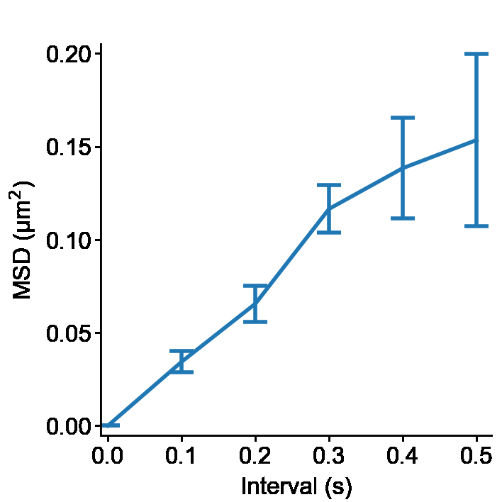

Basic usage
=======================
This short example of **Slitflow** usage enables us to overview **Slitflow**
by analyzing the trajectories of simulated random walks.

Installation
----------------
**Slitflow** can be installed from `PyPI <https://pypi.org/project/slitflow/>`_.

.. code-block:: console

   pip install slitflow

This command will install minimal dependencies for basic usage. Some analysis
class requires additional packages. To install all required packages,
see also the detailed :ref:`installation guide <develop:Installation>`.

We usually import slitflow as follows:

.. code-block:: python

   import slitflow as sf

Simulate random walks
------------------------
Start by creating an index object that defines the number of images and 
trajectories. Then we execute the ``run()`` method to make result data inside
the Index object.

See also :class:`slitflow.tbl.create.Index` for argument descriptions.

.. code-block:: python

   D1 = sf.tbl.create.Index()
   D1.run([], {"type": "trajectory", "index_counts": [2, 3], "split_depth": 0})
   print(D1.data[0])
   #   img_no trj_no
   # 0      1      1
   # 1      1      2
   # 2      1      3
   # 3      2      1
   # 4      2      2
   # 5      2      3

Then we append random walk coordinates to the index table by making the next 
analysis object. 

See also :class:`slitflow.trj.random.Walk2DCenter` for argument descriptions.

.. code-block:: python

   D2 = sf.trj.random.Walk2DCenter()
   D2.run([D1], {"diff_coeff": 0.1, "interval": 0.1, "n_step": 5, "length_unit": "um", "seed": 1, "split_depth": 0})
   print(D2.data[0])
   #    img_no  trj_no  frm_no      x_um      y_um
   # 0        1       1       1  0.000000  0.000000
   # 1        1       1       2  0.229717 -0.325487
   # 2        1       1       3  0.143202 -0.078733
   # 3        1       1       4  0.068507 -0.186384
   # 4        1       1       5 -0.083234 -0.141265
   # ...
   # 34       2       3       5 -0.218346  0.373677
   # 35       2       3       6 -0.247888  0.498855

Calculate the Mean Square Displacement
--------------------------------------
The following code calculates the MSD of each trajectory. Then MSDs are
averaged through all images.

See also :class:`slitflow.trj.msd.Each` and :class:`slitflow.tbl.stat.Mean`.

.. code-block:: python

   D3 = sf.trj.msd.Each()
   D3.run([D2], {"group_depth": 2, "split_depth": 0})

   D4 = sf.tbl.stat.Mean()
   D4.run([D3], {"calc_col": "msd", "index_cols": ["interval"], "split_depth": 0})
   print(D4.data[0])
   #    interval       msd       std       sem  count       sum
   # 0       0.0  0.000000  0.000000  0.000000      6  0.000000
   # 1       0.1  0.034335  0.014093  0.005754      6  0.206012
   # 2       0.2  0.065532  0.023673  0.009665      6  0.393195
   # 3       0.3  0.116515  0.031346  0.012797      6  0.699089
   # 4       0.4  0.138391  0.066066  0.026971      6  0.830347
   # 5       0.5  0.153488  0.112978  0.046123      6  0.920926

Make a figure image
-----------------------------
Then plot the averaged MSD against the time interval. The graph style is
adjusted using style class and creates a figure tiff image.

See also :class:`slitflow.fig.line.Simple`, :class:`slitflow.fig.style.Basic` and :class:`slitflow.fig.figure.ToTiff`

.. code-block:: python

      import matplotlib.pyplot as plt

      D5 = sf.fig.line.Simple()
      D5.run([D4], {"calc_cols": ["interval", "msd"], "err_col": "sem", "group_depth": 0, "split_depth": 0})

      D6 = sf.fig.style.Basic()
      D6.run([D5], {"limit": [-0.01, 0.52, -0.005, 0.205], "tick": [[0, 0.1, 0.2, 0.3, 0.4, 0.5], [0, 0.05,
            0.1, 0.15, 0.2]], "label": ["Interval (s)", "MSD (\u03bcm$^{2}$)"], "format": ['%.1f', '%.2f']})

      D7 = sf.fig.figure.ToTiff()
      D7.run([D6], {"split_depth": 0})

      plt.close()
      plt.imshow(D7.to_imshow(0))
      plt.axis("off")
      plt.show()

Run using pipeline
-----------------------------
The pipeline class can perform all the above steps while saving data to a
project folder.

.. code-block:: python

      import os

      # make a project directory (in the user directory)
      prj_dir = os.path.join(os.path.expanduser("~"),"slitflow","tutorial_pipeline")
      if not os.path.isdir(prj_dir):
         os.makedirs(prj_dir)
      print(prj_dir)

      # make and run a pipeline
      PL = sf.manager.Pipeline(prj_dir)
      obs_names = ["Sample1"]
      PL.add(sf.tbl.create.Index(), 0, (1, 1), 'channel1', 'index', 
            obs_names, [], [],
            {"type": "trajectory", "index_counts": [2, 3], "split_depth": 0})
      PL.add(sf.trj.random.Walk2DCenter(), 0, (1, 2), None, 'trj', 
            obs_names, [(1, 1)], [0],
            {"diff_coeff": 0.1, "interval": 0.1, "n_step": 5, "length_unit": "um", "seed": 1, "split_depth": 0})
      PL.add(sf.trj.msd.Each(), 0, (1, 3), None, 'msd', 
            obs_names, [(1, 2)], [0],
            {"group_depth": 2, "split_depth": 0})
      PL.add(sf.tbl.stat.Mean(), 0, (1, 4), None, 'avemsd',
            obs_names, [(1, 3)], [0],
            {"calc_col": "msd", "index_cols": ["interval"], "split_depth": 0})
      PL.add(sf.fig.line.Simple(), 0, (1, 5), None, 'msd_fig',
            obs_names, [(1, 4)], [0],
            {"calc_cols": ["interval", "msd"], "err_col": "sem", "group_depth": 0, "split_depth": 0})
      PL.add(sf.fig.style.Basic(), 0, (1, 6), None, 'msd_style',
            obs_names, [(1, 5)], [0],
            {"limit": [-0.01, 0.52, -0.005, 0.205], "tick": [[0, 0.1, 0.2, 0.3, 0.4, 0.5], [0, 0.05, 0.1, 0.15, 0.2]], 
            "label": ["Interval (s)", "MSD (\u03bcm$^{2}$)"], "format": ['%.1f', '%.2f']})
      PL.add(sf.fig.figure.ToTiff(), 0, (1, 7), None, 'msd_img',
            obs_names, [(1, 6)], [0],
            {"split_depth": 0})
      PL.save("pipeline")
      PL.run()

This code creates the following folder structure.

.. code-block:: bash

      tutorial_pipeline
       |--g0_config
       |    pipeline.csv
       |--g1_groupe1
           |--a1_index
           |    Sample1_index.csv
           |    Sample1_index.sf
           |    Sample1_index.sfx
           |--a2_trj
           |    Sample1_trj.csv
           |    Sample1_trj.sf
           |    Sample1_trj.sfx
           |--a3_msd
           |    Sample1_msd.csv
           |    Sample1_msd.sf
           |    Sample1_msd.sfx
           |--a4_avemsd
           |    Sample1_avemsd.csv
           |    Sample1_avemsd.sf
           |    Sample1_avemsd.sfx
           |--a5_msd_fig
           |    Sample1_msd_fig.fig
           |    Sample1_msd_fig.sf
           |    Sample1_msd_fig.sfx
           |--a6_msd_style
           |    Sample1_msd_style.fig
           |    Sample1_msd_style.sf
           |    Sample1_msd_style.sfx
           |--a7_msd_img
                Sample1_msd_img.tif
                Sample1_msd_img.sf
                Sample1_msd_img.sfx

We can use the make_flowchat() method of the pipeline object to create an
analytical flowchart diagram. The image is created as a PNG file in the
g0_config folder in the project directory.

.. code-block:: python

      PL.make_flowchart("pipeline", "grp_ana")

